<h2>
EfficientNet Cervical Cancer (Updated: 2022/11/12)
</h2>
<a href="#1">1 EfficientNetV2 Cervical Cancer Classification </a> 
<a href="#1.1">1.1 Clone repository</a> 
<a href="#1.2">1.2 Install Python packages</a> 
<a href="#2">2 Python classes for Cervical Cancer Classification</a> 
<a href="#3">3 Pretrained model</a> 
<a href="#4">4 Train</a> 
<a href="#4.1">4.1 Train script</a> 
<a href="#4.2">4.2 Training result</a> 
<a href="#5">5 Inference</a> 
<a href="#5.1">5.1 Inference script</a> 
<a href="#5.2">5.2 Sample test images</a> 
<a href="#5.3">5.3 Inference result</a> 
<a href="#6">6 Evaluation</a> 
<a href="#6.1">6.1 Evaluation script</a> 
<a href="#6.2">6.2 Evaluation result</a> 

<h2>
<a id="1">1 EfficientNetV2 Cervical Cancer Classification</a>
</h2>

This is an experimental project Cervical Cancer Classification based on <b>efficientnetv2</b> in <a href="https://github.com/google/automl">Brain AutoML</a>
The Cervical Cancer dataset used here has been taken from the following web site: 

<a href="https://data.mendeley.com/datasets/zddtpgzv63/4">Liquid based cytology pap smear images for multi-class diagnosis of cervical cancer</a>
  
License: CC BY 4.0 
 
 We use python 3.8 and tensorflow 2.8.0 environment on Windows 11 for this project. 
 
   
<h3>
<a id="1.1">1.1 Clone repository</a>
</h3>
 Please run the following command in your working directory: 
<pre>
git clone https://github.com/atlan-antillia/EfficientNet-Pap-Smear.git
</pre>
You will have the following directory tree: 
<pre>
.
├─asset
└─projects
    └─Cervical-Cancer
        ├─eval
        ├─evaluation
        ├─inference
        ├─models
        ├─Resampled-pap-smear-images
        │  ├─test
        │  │  ├─HSIL
        │  │  ├─LSIL
        │  │  ├─NL
        │  │  └─SCC
        │  └─train
        │      ├─HSIL
        │      ├─LSIL
        │      ├─NL
        │      └─SCC
        └─test
</pre>
<h3>
<a id="1.2">1.2 Prepare Cervical Cancer_Images</a>
</h3>

 1. We have downloaded an original dataset from the following website: 
<a href="https://data.mendeley.com/datasets/zddtpgzv63/4">Liquid based cytology pap smear images for multi-class diagnosis of cervical cancer</a>
 

2. For simplicity, we have renamed the folder names in the original dataset to be: 
<pre>
original_dataset
├─HSIL   (High squamous intra-epithelial lesion)
├─LSIL   (Low squamous intra-epithelial lesion)
├─NL     (Negative for Intraepithelial malignancy)
└─SCC    (Squamous cell carcinoma)
</pre>
3. We have created a resized <b>Liquid-based-cytology-pap-smear-images-512x512-master</b> dataset from the renamed dataset.
by using <a href="./projects/Cervical-Cancer/resize.py">resize.py</a>.
 

4. We have created <b>Resampled_pap_smear_images_master</b> by applying a dataset resampling tool 
<a href="https://github.com/martian-antillia/ImageDatasetResampler">ImageDatasetResampler</a>
to the resized dataset, . 

5. Finally, we have created <b>Resampled-pap-smear-images</b> by applying 
<a href="./projects/Cervical-Cancer/split_master">split_master.py</a> script to the resampled dataset. 
<pre>
Resampled-pap-smear-images
 ├─test
 │  └─HSIL
 │  ├─LSIL
 │  ├─NL
 │  └─SCC
 └─train
     ├─HSIL
     ├─LSIL
     ├─NL
     └─SCC
</pre>

The number of images of train and test image dataset is the following: 
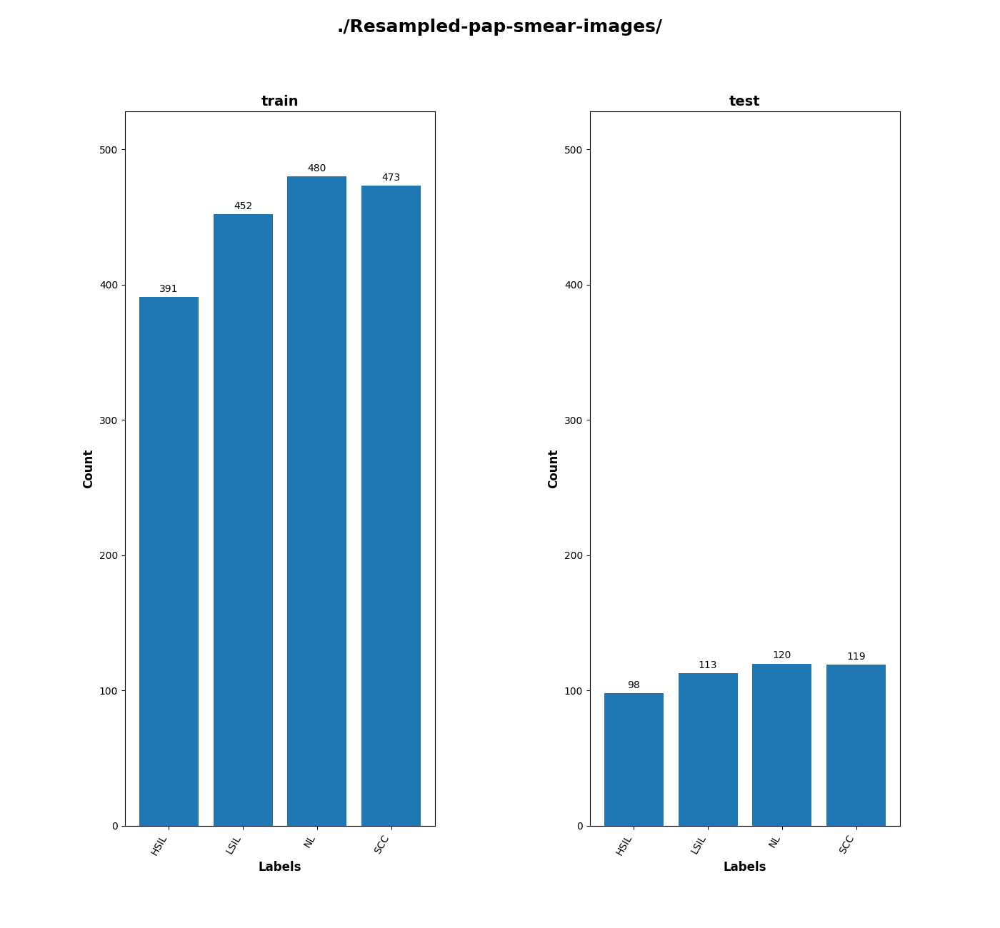
 
 
1 Sample images in Cervical Cancer_Images/train/HSIL: 
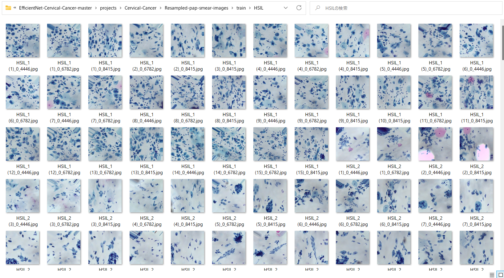  

2 Sample images in Cervical Cancer_Images/train/LSIL: 
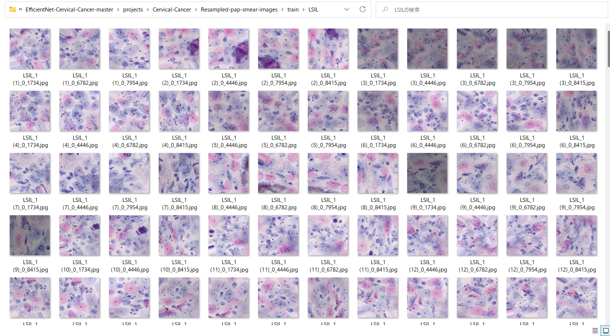  

3 Sample images in Cervical Cancer_Images/train/NL: 
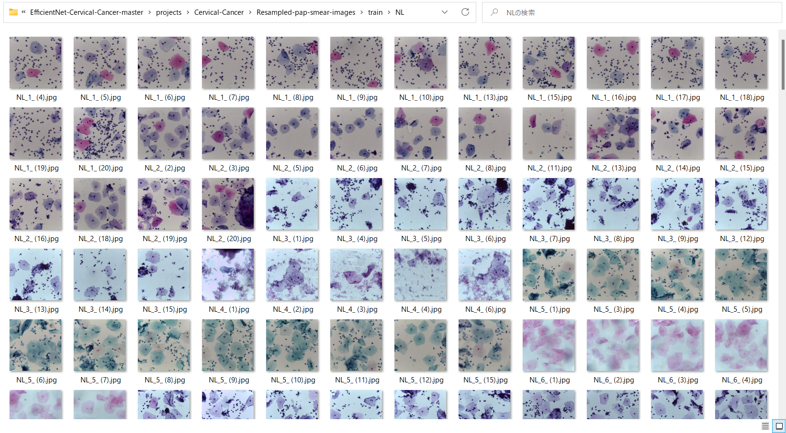  

4 Sample images in Cervical Cancer_Images/train/SCC: 
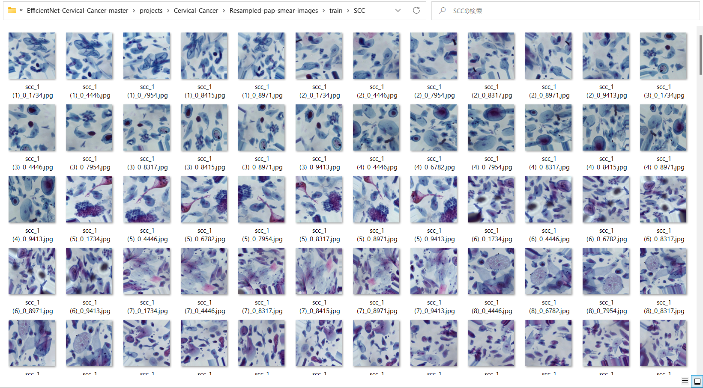  

<h3>
<a id="1.3">1.3 Install Python packages</a>
</h3>

Please run the following commnad to install Python packages for this project. 
<pre>
pip install -r requirements.txt
</pre>
 

<h2>
<a id="2">2 Python classes for Cervical Cancer Classification</a>
</h2>
We have defined the following python classes to implement our Cervical Cancer Classification. 

<li>
<a href="./ClassificationReportWriter.py">ClassificationResportWriter</a>
</li>
<li>
<a href="./ConfusionMatrix.py">ConfusionMatrix</a>
</li>
<li>
<a href="./CustomDataset.py">CustomDataset</a>
</li>
<li>
<a href="./EpochChangeCallback.py">EpochChangeCallback</a>
</li>
<li>
<a href="./FineTuningModel.py">FineTuningModel</a>
</li>
<li>
<a href="./EfficientNetV2Evaluator.py">EfficientNetV2Evaluator</a>
</li>

<li>
<a href="./EfficientNetV2ModelTrainer.py">EfficientNetV2ModelTrainer</a>
</li>

<li>
<a href="./EfficientNetV2Inferencer.py">EfficientNetV2Inferencer</a>
</li>
<li>
<a href="./TestDataset.py">TestDataset</a>
</li>
 

<h2>
<a id="3">3 Pretrained model</a>
</h2>
 We have used pretrained <b>efficientnetv2-b0</b> to train Cervical Cancer Classification Model by using
 the dataset <b>./projects/Cervical-Cancer/Cervical_Cancer_Images/train</b>.

  
Please download the pretrained checkpoint file from <a href="https://storage.googleapis.com/cloud-tpu-checkpoints/efficientnet/v2/efficientnetv2-m.tgz">efficientnetv2-m.tgz</a>, expand it, and place the model under our top repository.

<pre>
.
├─asset
├─efficientnetv2-m
└─projects
    └─Cervical-Cancer
</pre>

<h2>
<a id="4">4 Train</a>
</h2>
<h3>
<a id="4.1">4.1 Train script</a>
</h3>
Please run the following bat file to train our Cervical Cancer efficientnetv2-b0 model by 
using the dataset <b>./projects/Cervical-Cancer/Resampled-pap-smear-images/train</b>. 
 
<pre>
./1_train.bat
</pre>
<pre>
rem 1_train.bat
python ../../EfficientNetV2ModelTrainer.py ^
  --model_dir=./models ^
  --eval_dir=./eval ^
  --model_name=efficientnetv2-m  ^
  --data_generator_config=./data_generator.config ^
  --ckpt_dir=../../efficientnetv2-m/model ^
  --optimizer=rmsprop ^
  --image_size=384 ^
  --eval_image_size=480 ^
  --data_dir=./Resampled-pap-smear-images/train ^
  --data_augmentation=True ^
  --valid_data_augmentation=True ^
  --fine_tuning=True ^
  --monitor=val_loss ^
  --learning_rate=0.0001 ^
  --trainable_layers_ratio=0.4 ^
  --dropout_rate=0.4 ^
  --num_epochs=100 ^
  --batch_size=4 ^
  --patience=10 ^
  --debug=True  
</pre>
,where data_generator.config is the following 
<pre>
; data_generation.config

[training]
validation_split   = 0.2
featurewise_center = False
samplewise_center  = False
featurewise_std_normalization=False
samplewise_std_normalization =False
zca_whitening                =False
rotation_range     = 90
horizontal_flip    = True
vertical_flip      = True
 
width_shift_range  = 0.1
height_shift_range = 0.1
shear_range        = 0.01
zoom_range         = [0.1, 2.0]
data_format        = "channels_last"
[validation]
validation_split   = 0.2
featurewise_center = False
samplewise_center  = False
featurewise_std_normalization=False
samplewise_std_normalization =False
zca_whitening                =False
rotation_range     = 90
horizontal_flip    = True
vertical_flip      = True
width_shift_range  = 0.1
height_shift_range = 0.1
shear_range        = 0.01
zoom_range         = [0.1, 2.0]
data_format        = "channels_last"
</pre>

This will generate a <b>best_model.h5</b> in the models folder specified by --model_dir parameter. 
Furthermore, it will generate a <a href="./projects/Cervical-Cancer/eval/train_accuracies.csv">train_accuracies</a>
and <a href="./projects/Cervical-Cancer/eval/train_losses.csv">train_losses</a> files
 
<h3>
<a id="4.2">Training result</a>
</h3>

Training console output: 

 
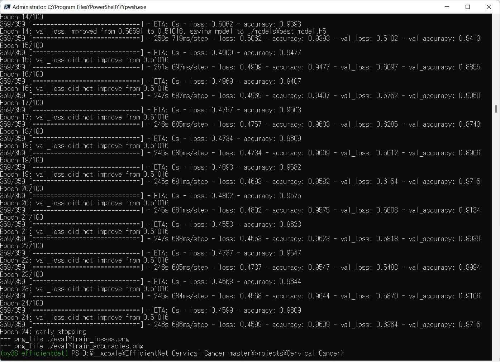 

As shown above, please note that the <b>best_model.h5</b> has been saved at epoch 14.
 
 
Train_accuracies: 
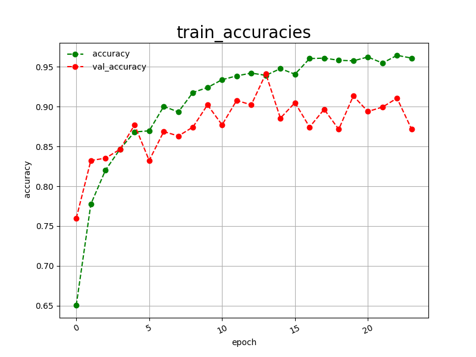 

 
Train_losses: 
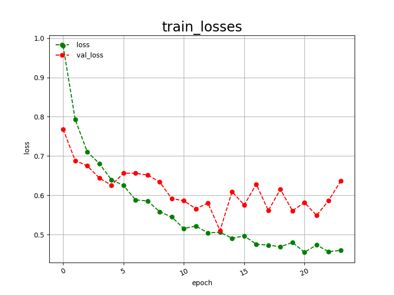 

 

<h2>
<a id="5">5 Inference</a>
</h2>
<h3>
<a id="5.1">5.1 Inference script</a>
</h3>
Please run the following bat file to infer the Cervical Cancer test images by the model generated by the above train command. 
<pre>
./2_inference.bat
</pre>
<pre>
rem 2_inference.bat
python ../../EfficientNetV2Inferencer.py ^
  --model_name=efficientnetv2-m  ^
  --model_dir=./models ^
  --fine_tuning=True ^
  --trainable_layers_ratio=0.4 ^
  --dropout_rate=0.4 ^
  --image_path=./test/*.jpg ^
  --eval_image_size=480 ^
  --label_map=./label_map.txt ^
  --mixed_precision=True ^
  --infer_dir=./inference ^
  --debug=False 
</pre>
, where label_map.txt is the following: 
<pre>
HSIL
LSIL
NL
SCC
</pre>
 

<h3>
<a id="5.2">5.2 Sample test images</a>
</h3>

Sample test images generated by <a href="./projects/Cervical-Cancer/create_test_dataset.py">create_test_dataset.py</a> 
from <a href="./projects/Cervical-Cancer/Cervical_Cancer_Images/test">Cervical Cancer_Images/test</a>.
Cervical-Cancer/test: 
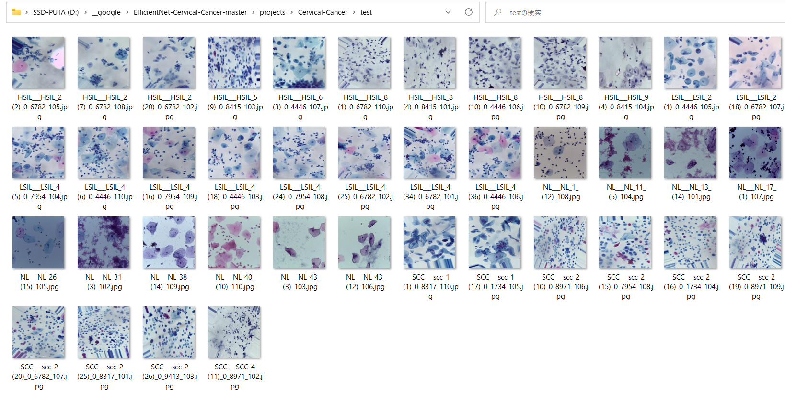
  

<h3>
<a id="5.3">5.3 Inference result</a>
</h3>

This inference command will generate <a href="./projects/Cervical-Cancer/inference/inference.csv">inference result file</a>.
 
Inference console output: 
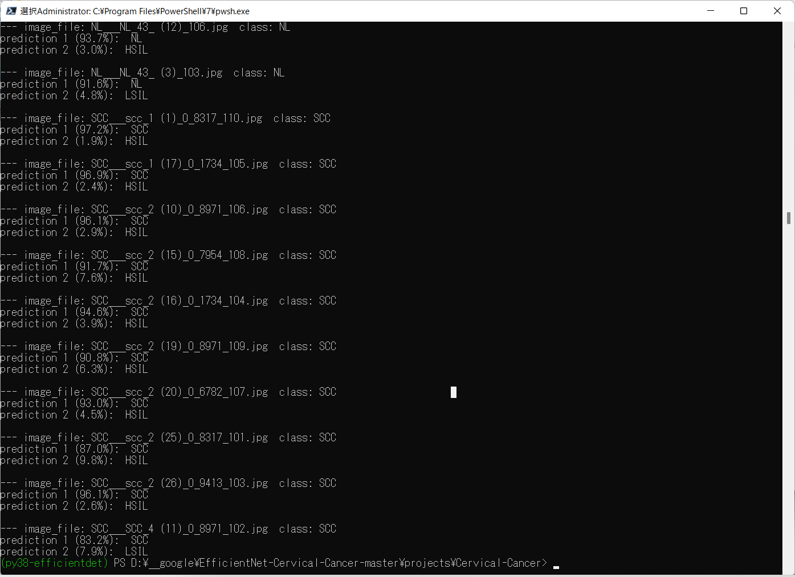 
 
Inference result: 
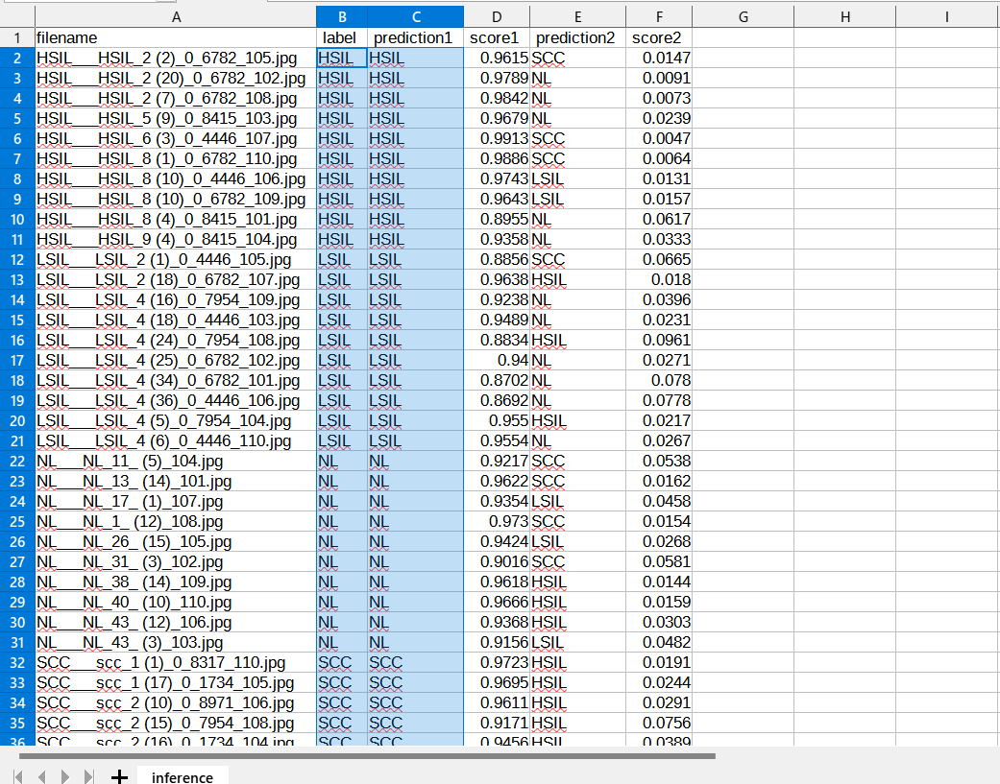 

<h2>
<a id="6">6 Evaluation</a>
</h2>
<h3>
<a id="6.1">6.1 Evaluation script</a>
</h3>
Please run the following bat file to evaluate <a href="./projects/Cervical-Cancer/Cervical_Cancer_Image/test">Cervical-Cancer/Cervical_Cancer_Image/test dataset</a> by the trained model. 
<pre>
./3_evaluate.bat
</pre>
<pre>
rem 3_evaluate.bat
python ../../EfficientNetV2Evaluator.py ^
  --model_name=efficientnetv2-m  ^
  --model_dir=./models ^
  --data_dir=./Resampled-pap-smear-images/test ^
  --evaluation_dir=./evaluation ^
  --fine_tuning=True ^
  --trainable_layers_ratio=0.4 ^
  --dropout_rate=0.4 ^
  --eval_image_size=480 ^
  --label_map=./label_map.txt ^
  --mixed_precision=True ^
  --debug=False 
</pre>

<h3>
<a id="6.2">6.2 Evaluation result</a>
</h3>

This evaluation command will generate <a href="./projects/Cervical-Cancer/evaluation/classification_report.csv">a classification report</a>
 and <a href="./projects/Cervical-Cancer/evaluation/confusion_matrix.png">a confusion_matrix</a>.
 
 
Evaluation console output: 
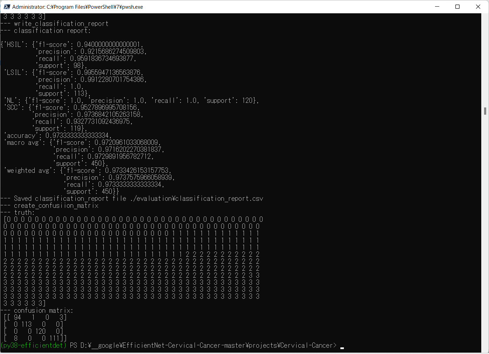 
 

Classification report: 
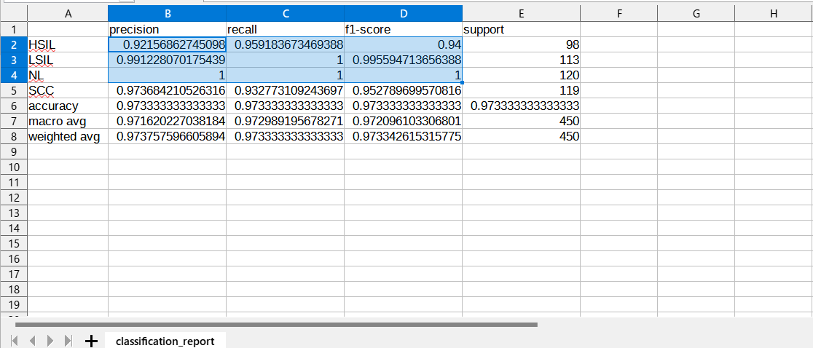 
 
Confusion matrix: 
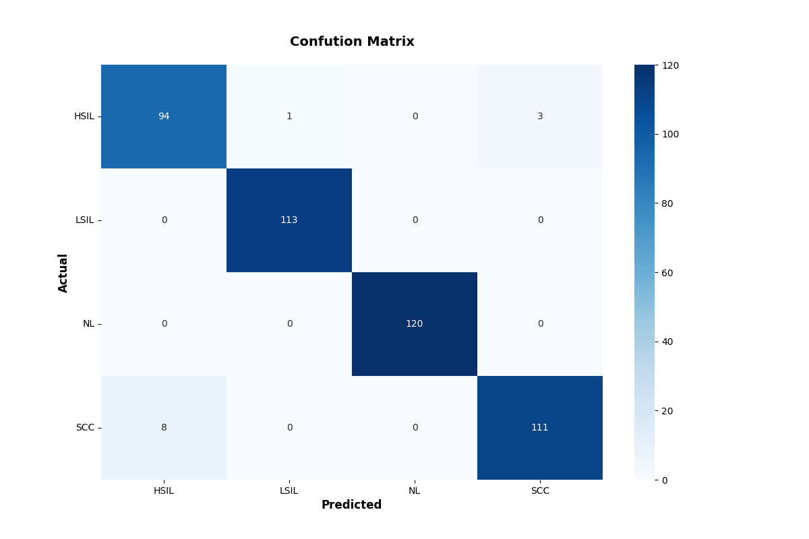 

<h3>References</h3>
<b>1, Liquid based cytology pap smear images for multi-class diagnosis of cervical cancer</b> 
<pre>
https://data.mendeley.com/datasets/zddtpgzv63/4
</pre>

<b>
2. Pap-smear Benchmark Data For Pattern Classification </b>
Jan Jantzen, Jonas Norup , George Dounias , Beth Bjerregaard 

<pre>
https://www.researchgate.net/publication/265873515_Pap-smear_Benchmark_Data_For_Pattern_Classification

</pre>
<b>
3. Deep Convolution Neural Network for Malignancy Detection and Classification in Microscopic Uterine Cervix Cell Images</b> 
Shanthi P B,1 Faraz Faruqi, Hareesha K S, and Ranjini Kudva 
<pre>
https://www.ncbi.nlm.nih.gov/pmc/articles/PMC7062987/
</pre>

<b>
4. DeepCyto: a hybrid framework for cervical cancer classification by using deep feature fusion of cytology images</b> 
Swati Shinde, Madhura Kalbhor, Pankaj Wajire 
<pre>
https://www.aimspress.com/article/doi/10.3934/mbe.2022301?viewType=HTML#b40
</pre>

